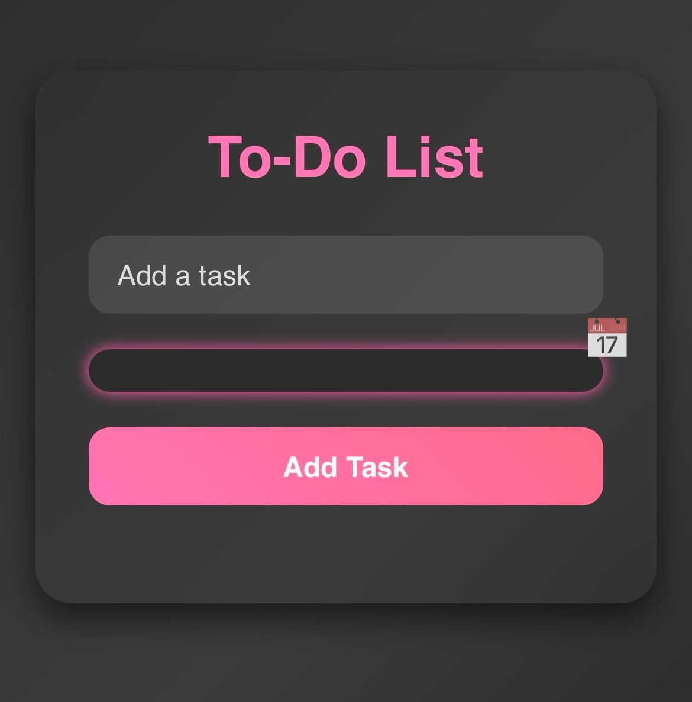

# 📋 To-Do List

A simple and handy To-Do List app for managing your tasks.

Created for practicing **HTML**, **CSS**, and **JavaScript** skills.

---

## 📸 Screenshot



---

## 🚀 Features

✅ Add new tasks  
✅ Set due dates  
✅ Mark tasks as completed  
✅ Delete tasks  
✅ Save tasks in localStorage  
✅ Smooth animations  
✅ Dark theme  

---

## 🌍 Live Demo

👉 [To-Do List Live](https://laladadasheva.github.io/ToDoList/)

---

## 🛠️ Technologies

- HTML5  
- CSS3  
- Vanilla JavaScript  
- localStorage  

---

## 📦 How to Run

1. Clone the repository:

   ```bash
   git clone git@github.com:LalaDadasheva/ToDoList.git
2. Open index.html in your browser.

🤝 Contributions
Contributions, issues, and feature requests are welcome!
If you’d like to contribute — feel free to fork this repo and submit a pull request.


## 📑 License

This project is licensed under the [MIT License](LICENSE).